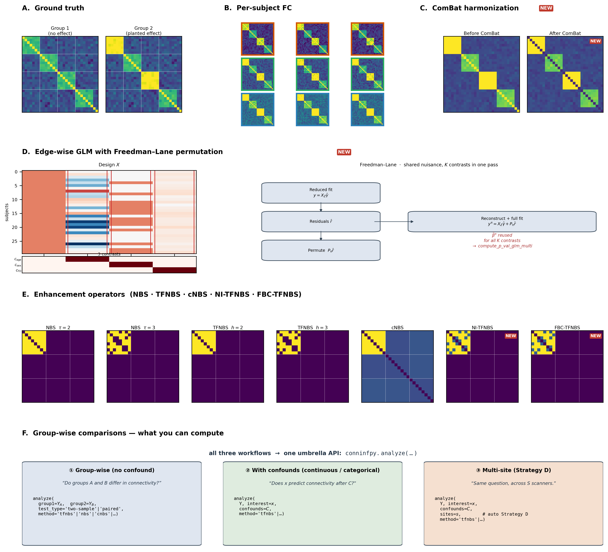

# ConnInfPy — Connectivity Inference in Python

[](https://ihb-ibr-department.github.io/ConnInfPy/)


**A unified Python framework for permutation-based statistical inference on brain connectivity networks (fMRI, EEG).**

ConnInfPy implements a single permutation engine shared across nine inference
methods, with edge-wise GLM (Freedman–Lane), confound-aware cross-site
harmonization (parametric empirical-Bayes ComBat), and tail-approximation
acceleration — all under one Python API.

What you get out of one `pip install`:

- **Six topology-aware enhancement operators** — NBS-extent, NBS-intensity,
  TFNBS, cNBS, **NI-TFNBS** (novel — network-informed soft block-density
  prior), **FBC-TFNBS** (novel — hard block-prior with minimum cluster
  size) — plus three baselines (per-edge $t$, Bonferroni, BH-FDR), all
  sharing one permutation engine and the +1 Phipson–Smyth correction.
- **Edge-wise GLM with Freedman–Lane permutation** — continuous predictors,
  confound regression, $t$/$\beta$/F-contrast statistics, paired
  within-subject designs with Δ-level confounds, two-tailed FWER with
  positive/negative directional split.
- **GPD/gamma tail acceleration** — 200-perm runs reproduce 5000-perm
  empirical FWER p-values on real data to within $|\Delta(-\log_{10}p)| \le 0.001$
  on >99% of edges (≈25× wall-clock saving), with Anderson–Darling
  goodness-of-fit guard and empirical fallback.
- **Default JIT acceleration** — the TFNBS connected-components inner
  loop uses a JIT-compiled union-find (via `numba`), giving ≈12× speedup on
  per-call scoring and ≈15× end-to-end on the 60×60 / 200-perm
  benchmark. Graceful fallback to SciPy if JIT is unsupported.
- **In-package multi-site harmonization** — parametric empirical-Bayes
  ComBat (Johnson 2007; Fortin 2017/2018) reimplemented in NumPy, with
  separate `combat_fit`/`combat_apply` for cross-site ML transfer and a
  `design_diagnostics` layer (VIF + condition number + plain-English flags).
- **19-scenario topology benchmark library** — controlled effect topologies
  (hub, rich-club, chain, scattered, gradient, fragmented within-module,
  …) used in the paper's no-method-dominates-across-topologies finding.



### What's in the figure (panels A–H)

The 8-panel figure walks the full pipeline from raw multi-site
connectivity data to FWER-corrected $p$-maps. Each block corresponds to
a distinct stage of the inference pipeline:

| Panel | Stage | What is shown | Code entry-points |
|---|---|---|---|
| **A** | Ground truth | Side-by-side Group 1 (no effect) vs Group 2 (planted effect on a within-module-dense topology); 30×30 modular matrices in viridis | `conninfpy.topologies` (19-scenario library), `generate_fc_matrices` |
| **B** | Multi-site FC | Stack of per-subject Fisher-$z$ FC matrices coloured by acquisition site, exhibiting visible site-effect heterogeneity | `fisher_r_to_z` |
| **C** | Harmonization (NEW) | ComBat before/after — between-site mean FC visibly homogenised while age/sex/diagnosis are preserved | `combat_harmonize`, `combat_fit`/`combat_apply`, `design_diagnostics` |
| **D** | GLM + Freedman–Lane (NEW) | Design matrix $X$ → reduced-model residual permutation → reconstructed $y^{\pi}$ → per-edge $t$ / $\beta$ / $F$. **Multi-contrast support**: several contrasts of interest (e.g. age, sex, motion) are evaluated under one shared nuisance model in a single permutation pass — $\hat\beta^\pi$ is reused across all $K$ contrasts. | `compute_p_val_glm`, `compute_p_val_glm_multi` (NEW), `compute_p_val_paired_glm`, `build_design_matrix` |
| **E** | NBS | Fixed cluster-defining threshold $\tau$ + connected-components labelling — illustrates the parameter that TFNBS eliminates | `nbs_bct`, `compute_p_val(method="nbs")` |
| **F** | TFNBS | Threshold-free integration $S_e = \sum_h [\eta_h(e)]^E h^H \Delta h$ across $\mathcal{H}$; FDR-calibrated regime $(E, H) = (0.3, 3.0)$ | `get_tfnbs_score`, `apply_tfnbs`, `compute_p_val(method="tfnbs")` |
| **G** | Block-prior methods (NEW) | cNBS (Yeo-7 block aggregation) · **NI-TFNBS** (block-density soft prior, $\omega_B(h) = k_B(h)/\sqrt{|B|}$) · **FBC-TFNBS** (atomic blocks with $m_{\min}$ threshold) | `apply_cnbs`, `apply_ni_tfnbs`, `apply_fbc_tfnbs` |
| **H** | Inference layer | Max-stat permutation null + GPD tail fit (200-perm reproduces 5{,}000-perm empirical $p$ to $\|\Delta(-\log_{10} p)\| \le 0.001$ on $>99\,\%$ of edges) + per-tail FWER $p$-maps (positive/negative directional split) | `fit_gpd_tail`, `compute_p_values_accelerated`, `acceleration="gpd"` |

Panels marked **NEW** are contributions of this package: in-package
ComBat (C), edge-wise GLM with Freedman–Lane and the F-contrast / paired-Δ
wrappers (D), NI-TFNBS and FBC-TFNBS block-prior operators (G), and
network-level GPD tail acceleration (H).

> **History.** Originally developed as a TFNBS-only implementation
> (`tfnbs`); renamed and substantially expanded in 2026-04 to the
> unified framework presented here. The old GitHub URL
> `https://github.com/IHB-IBR-department/TFNBS` redirects automatically.

---

## Installation

```bash
# Create the conda env (Python 3.11)
conda create -n conninfpy python=3.11 -y
conda activate conninfpy

# Install the package (includes core speedups)
pip install conninfpy

# For development (unit tests, docs, notebook tools)
pip install "conninfpy[dev]"
```

## Running the tests

```bash
python -m unittest discover -s tests -t .
```

The suite uses Python's standard `unittest` (no pytest required). Per-module or
per-class runs:

```bash
python -m unittest tests.test_glm_stats
python -m unittest tests.test_glm_stats.TestFStatCompute
python -m unittest tests.test_glm_stats.TestFStatCompute.test_fstat_single_row_equals_tstat_squared
```

## Building the docs

```bash
cd docs
sphinx-build source _build
# Docs auto-build on push to main via GitHub Actions → gh-pages.
```

---

## What's in the package

### Statistical inference

| Function | Purpose | Design |
|---|---|---|
| `compute_p_val` | Permutation p-values for group comparisons | Two-sample, paired, or one-sample |
| `compute_p_val_glm` | GLM with confound regression | Continuous predictors + nuisance, Freedman-Lane permutation; supports 1D contrast (t-stat/beta) and 2D contrast (omnibus F-test) |
| `compute_p_val_glm_multi` | Several contrasts under one shared nuisance model in **one** permutation pass | Reuses the reduced-model residual reconstruction across `K` contrasts → ~`K`× speedup vs `K` independent calls; returns `Dict[str, InferenceResult]` keyed by user-supplied contrast names |
| `compute_p_val_paired_glm` | Paired A vs B with Δ-level confounds | Convenience wrapper — routes to paired-t when no confounds, else one-sample GLM on Δ |
| `compute_null_dist` | Generate null distribution only | For custom workflows |
| `compute_t_stat` / `compute_t_stat_diff` | Edge-wise t-statistics | Paired / one-sample / two-sample |
| `compute_glm_stat` | Edge-wise GLM statistic | `stat_type ∈ {tstat, beta, fstat}` |
| `build_design_matrix` | Convenience builder for `X` + contrast | Interest + confounds → `[1, C, interest]` |

### Enhancement methods (shared between t-test and GLM pipelines)

| Method string | Description | Required args |
|---|---|---|
| `tstat` | Raw t-statistics, max-stat correction | — |
| `tfnbs` | Threshold-free cluster enhancement for networks | `e, h, n, start_thres` |
| `nbs` | Classical NBS with fixed threshold | `threshold, nbs_stat` |
| `cnbs` | Constrained NBS (block-level aggregation) | `net_labels` |
| `ni_tfnbs` | Network-informed TFNBS (spatial priors) | `net_labels` |
| `fbc_tfnbs` | Functional-block clustering TFNBS | `net_labels, min_cluster_size` |
| `bonferroni` / `bh_fdr` | Parametric baselines (no permutation) | — |
| `bh_fdr_perm` | Permutation-based BH-FDR | — |

Enhancement can also be applied standalone (no permutation) via
`apply_tfnbs`, `apply_nbs`, `apply_cnbs`, `apply_ni_tfnbs`, `apply_fbc_tfnbs`.

### Permutation acceleration (Winkler et al. 2016)

| Function | Purpose |
|---|---|
| `fit_gpd_tail` | GPD tail approximation — 10–25× speedup |
| `fit_gamma_tail` | Gamma (Pearson type III) approximation |
| `compute_p_values_accelerated` | Drop-in replacement for empirical p-values |

Integrated via `acceleration='gpd'|'gamma'` in both `compute_p_val` and
`compute_p_val_glm` (~200 permutations instead of ~5000).

### Multi-site harmonization & design diagnostics (`conninfpy.harmonize`)

Parametric empirical-Bayes ComBat (Johnson 2007) implemented in pure numpy —
no `neuroHarmonize` or `neurocombat` dependency.

| Function | Purpose |
|---|---|
| `combat_harmonize(Y, sites, preserve=None)` | Fit + transform in one call; returns `CombatResult` with `Y_adjusted`, fitted `model`, and between-site variance diagnostics |
| `combat_fit` / `combat_apply` | Separate fit and apply — for cross-site ML transfer (fit on training sites, apply to held-out subjects) |
| `compute_vif(X)` | Variance inflation factor per design-matrix column |
| `design_diagnostics(X, names=None)` | Condition number, VIF, pairwise correlation, plain-English flags |
| `flatten_upper` / `unflatten_upper` | Vectorise / un-vectorise the upper triangle of `(n, N, N)` connectivity |

Accepts either `(n, N, N)` connectivity matrices or pre-flattened `(n, p)`
features.

### Synthetic data + topology library

| Function / class | Purpose |
|---|---|
| `generate_fc_matrices` | Modular network with controlled effect size |
| `ModularDatasetGenerator` | Class-based generator for modular network structures |
| `TopologyDatasetGenerator`, `get_scenario`, `list_scenarios` | 19+ canonical scenarios (hub, chain, rich_club, within/between-module, gradient, core-periphery, …) for methods benchmarking |

### Core primitives & utilities

- `tfnbs_score.py`: `get_tfnbs_score`, `get_network_informed_tfnbs_score`, `get_fbc_tfnbs_score` — the underlying scoring functions.
- `nbs_score.py`: `nbs_bct` — classical NBS reference.
- `utils.py`: `fisher_r_to_z`, `fisher_z_to_r`, `get_components`, `binarize`.
- `eeg_utils.py`: EEG-specific data structures (`EEGData`, `Electrodes`, `Bands`, `PairsElectrodes1020`) and helpers.

---

## Minimal usage

### Two-sample permutation (t-test pipeline)

```python
from conninfpy import compute_p_val, fisher_r_to_z

group1_z = fisher_r_to_z(group1)   # (n1, N, N), symmetric, zero diagonal
group2_z = fisher_r_to_z(group2)

p_vals = compute_p_val(
    group1_z, group2_z,
    test_type="two-sample",
    method="tfnbs",
    n_permutations=1000,
    e=0.4, h=3.0, n=10,
    use_mp=True,
)
# → {'positive': (N, N), 'negative': (N, N)}
```

### GLM with continuous predictor and confounds

```python
from conninfpy import compute_p_val_glm, fisher_r_to_z

Y = fisher_r_to_z(connectivity_matrices)     # (n_subjects, N, N)
p_vals = compute_p_val_glm(
    Y, interest=age, confounds=motion,
    method="tfnbs", n_permutations=5000,
)
# → {'positive': (N, N), 'negative': (N, N)}
```

### Paired design with difference-level confound (new)

```python
from conninfpy import compute_p_val_paired_glm

# Y_A, Y_B: aligned (n_subjects, N, N); fd_A, fd_B: per-condition motion
p_vals = compute_p_val_paired_glm(
    Y_A, Y_B,
    confounds_A=fd_A, confounds_B=fd_B,  # None to skip → delegates to paired t-test
    method="tfnbs", n_permutations=5000,
)
# Tests A vs B within-subject, partialling out Δmotion = fd_A − fd_B.
```

### Multi-contrast GLM in one permutation pass (new in v2.0)

```python
import numpy as np
from conninfpy import compute_p_val_glm_multi

# Same 4-column design ([intercept, age, sex, motion]); test 3 contrasts
# under one shared nuisance model.
X = np.column_stack([np.ones(n), age, sex, motion])
contrasts = {
    "age":    np.array([0, 1, 0, 0]),
    "sex":    np.array([0, 0, 1, 0]),
    "motion": np.array([0, 0, 0, 1]),
}

results = compute_p_val_glm_multi(
    Y, X, contrasts,
    method="tfnbs", n_permutations=5000, acceleration="gpd",
    rng=42,
)
# → {'age': InferenceResult, 'sex': InferenceResult, 'motion': InferenceResult}

print(results["age"])           # InferenceResult repr w/ wall_time, n_sig
results["motion"].n_significant(0.05)
```

The reduced-model residual reconstruction and ``X_pinv @ Y_perm``
matrix multiplication are reused across all contrasts, so wall-time is
~1× a single ``compute_p_val_glm`` call rather than 3×. F-stat /
multi-row contrasts are unsupported here — call
``compute_p_val_glm`` once per omnibus test.

### Omnibus F-contrast for ≥3 conditions (new)

```python
import numpy as np
from conninfpy import compute_p_val_glm

# 3-group dummy coding: intercept + group_B + group_C (group_A = reference)
X = np.column_stack([np.ones(n), group_B, group_C])
# Joint test β_B = β_C = 0
C = np.array([[0, 1, 0], [0, 0, 1]])

p_vals = compute_p_val_glm(
    Y, design_matrix=X, contrast=C,
    stat_type="fstat",
    method="tfnbs", n_permutations=5000,
)
# → {'omnibus': (N, N)}   -- F is non-negative, no sign to split
```

### Multi-site harmonization (new)

```python
from conninfpy import combat_harmonize, design_diagnostics
import numpy as np

# Harmonize site-aligned variance while preserving biological covariates
result = combat_harmonize(
    Y, sites=site_labels,
    preserve=np.column_stack([age, sex, diagnosis]),
)
Y_adjusted = result.Y_adjusted
print(result.diagnostics)   # between-site variance reduction, per-site n, ...

# Audit your design matrix before running the GLM
X = np.column_stack([np.ones(n), age, motion, *site_dummies])
report = design_diagnostics(X, names=["intercept", "age", "fd", "site_1", "site_2"])
for flag in report["flags"]:
    print("⚠️ ", flag)
```

### Acceleration (fewer permutations, same FWER)

```python
p_vals = compute_p_val_glm(
    Y, interest=age, confounds=motion,
    method="tfnbs", n_permutations=200,
    acceleration="gpd",   # ~25× speedup; also 'gamma'
)
```

---

## Tutorials and examples

| Path | What |
|---|---|
| [examples/notebooks/](examples/notebooks/) | Interactive tutorial series: quickstart, enhancement methods, GLM, acceleration, parameter sweeps, topology gallery, EEG, results export, and ABIDE |
| [examples/benchmarks/](examples/benchmarks/) | Timing / GLM / acceleration / precompsum benchmarks with CSV output and `plot_results.py` |
| [examples/miccai_paper_reproducing/](examples/miccai_paper_reproducing/) | Simulation validation (FPR + power) backing the MICCAI 2026 submission |
| [examples/abide_validation/](examples/abide_validation/) | Real-data validation on ABIDE (age, diagnosis, motion, within-site replication) |
| [examples/ml_transfer/](examples/ml_transfer/) | Open-Close bidirectional ML transfer (IHB ↔ China) |
| [examples/sim_method_comparisons/](examples/sim_method_comparisons/) | Side-by-side method comparison on synthetic data |

Single-command method-comparison example:

```bash
python examples/sim_method_comparisons/sim_method_comparisons.py \
    --all-scenarios --effect-size 0.25 --time-points 50 --n-permutations 50
```

---

## Documentation

Full reference at [IHB-IBR-department.github.io/ConnInfPy](https://IHB-IBR-department.github.io/ConnInfPy/).
The docs auto-build on push to `main`.

## Citing the toolbox

To cite the toolbox: [doi]() and refer to the paper [paper_doi]()

```
[doi]
```

For further discussions or to report bugs, please contact [knyazeva@ihb.spb.ru](mailto:knyazeva@ihb.spb.ru) or open an issue at https://github.com/IHB-IBR-department/ConnInfPy/issues.
